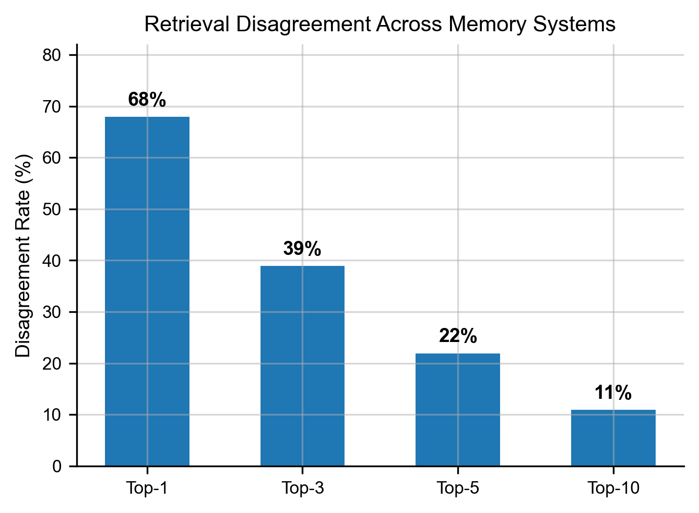
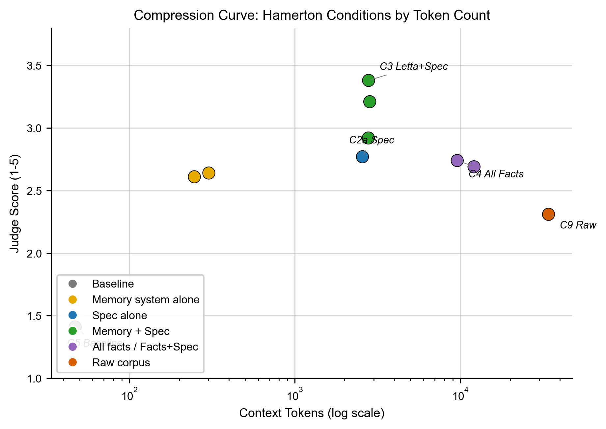
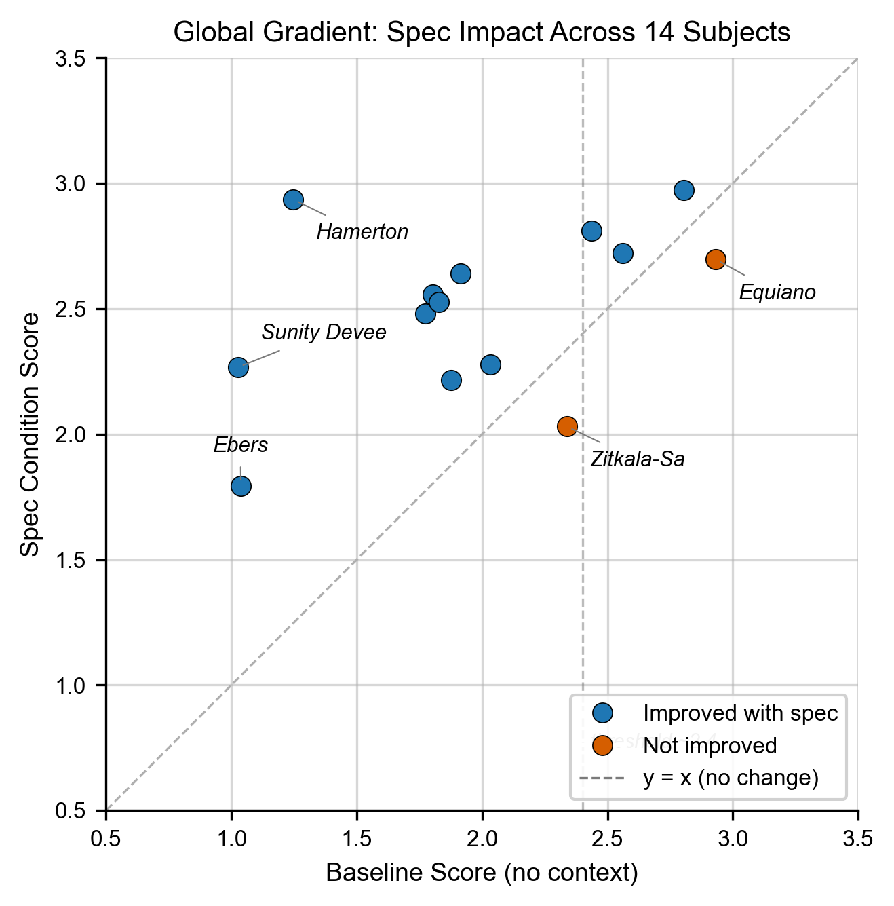
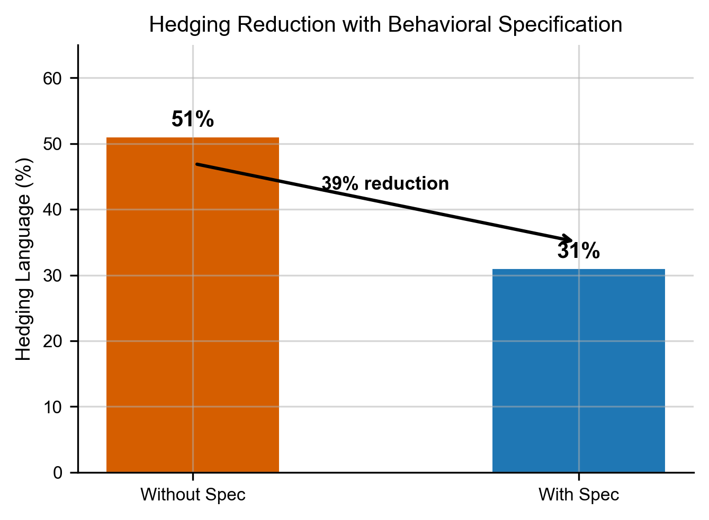

<!-- ## EMERGING FINDINGS FROM MEMORY EXPANSION (S111, 2026-04-15)

### Confidence Gate / Interference Effect
For high-baseline subjects (e.g., Zitkala-Sa, baseline 2.60), adding ANY context — spec, retrieved facts, or both — degrades performance. The spec alone (2.19) scores WORSE than baseline. Retrieval + spec (2.13-2.40 across 4 systems) also worse. The effect is consistent across all 4 memory systems.

**Interpretation:** The spec introduces behavioral constraints that compete with the model's internalized representation from pretraining. For known subjects, the model already has those constraints in its weights. The external spec forces the model to reconcile two sets of behavioral guidance instead of following the one it already has. It's like giving driving directions to someone who lives on that street — the directions aren't wrong, but processing them degrades performance.

**Product implication:** A serving layer needs a confidence gate. Before injecting a spec, estimate whether the model already knows this person. If confidence is high, don't inject. If low, inject everything. No current system does this.

**Paper implication:** This strengthens the threshold finding (~2.4 baseline). Above that threshold, the optimal strategy is zero injection. Below it, full spec injection. The spec is a tool for the unknown — and the data now shows WHY it hurts for the known (interference, not irrelevance).

Cross-system data (zitkala_sa, all 4 systems JUDGED):
- C5 baseline: 2.60
- C2a spec only: 2.19
- C1_supermemory (retrieval only): 2.60
- C1_mem0: 2.39
- C1_letta: 2.30
- C1_zep: 2.18
- C3_supermemory (spec+ret): 2.40
- C3_mem0: 2.29
- C3_letta: 2.24
- C3_zep: 2.13

### C2a vs C1 Comparison (spec alone vs retrieval alone)
Early Letta data (10/14 subjects) shows spec alone (C2a) outperforms retrieval alone (C1) for low-baseline subjects but underperforms for high-baseline subjects. Cross-system data needed to confirm.

### Cost Section (add to Discussion)
Add a brief implementation cost paragraph:
- Spec generation: ~$2-5 one-time per subject (Haiku extraction + Sonnet authoring + Opus composition)
- Spec-only injection: $0 ongoing (5K tokens in system prompt, no memory system needed)
- Memory system if used: $0-25/mo (Supermemory free, Mem0 $19, Letta $20, Zep $25)
- The spec-only approach (C2a) is competitive with spec+retrieval (C3) for most subjects at zero marginal cost
- Frame as: the spec is a one-time investment that reduces or eliminates the need for ongoing memory system costs
- Note: as the subject's life evolves, the spec needs periodic regeneration — but the cost remains one-time per update, not per-query
-->

<!-- ## EDITORIAL NOTES (address before final submission, then delete this section)
- [ ] TLDR line under title: "A static 3,000-token (~1,800-word) behavioral specification, with no retrieval, outperforms every state-of-the-art memory system on representational accuracy."
- [ ] Define "representational accuracy" explicitly in Section 1 or 3.1: "the degree to which a model's working model of a person predicts that person's actual behavior in novel situations, operationalized through behavioral prediction of held-out situations the subject actually faced."
- [ ] Numbers to update after memory expansion: Table 4.4, abstract percentages, memory system claims (currently N=1 for C1/C3)
- [ ] Gemini Pro judging incomplete (6 of 7 judges in current numbers)
- [ ] Low baseline vs high baseline discussion needs deeper treatment (see project_analysis_notes.md)
- [ ] Confidence scores and error rates analysis
- [ ] Wrong spec variance as noise floor for significance
- [ ] C2a vs C1 comparison across all 14 subjects (spec alone vs retrieval alone -- the headline finding)
- [ ] Reassess all percentages after memory expansion data lands
-->

# Beyond Recall: Behavioral Specification as the Missing Primitive for AI Personalization

**Authors:** Aarik Gulaya, Base Layer
**Date:** April 2026
**Preprint** (Apache 2.0)
**Data + Code:** github.com/agulaya24/base-layer
**Study Repository:** github.com/agulaya24/memory-study-repo

**Disclosure:** The author is the founder of Base Layer, which provides an open-source implementation of the pipeline described in this paper. All data, code, question batteries, judge scores, and evaluation artifacts are released under Apache 2.0 to enable independent verification and replication.

---

## Abstract

AI memory systems optimize for recall: storing what a user said and retrieving it when relevant. Four state-of-the-art (SOTA) memory systems (Mem0, Letta, Supermemory, Zep) all score 85%+ on recall benchmarks. 

This kind of consistent performance suggests the benchmark needs to evolve. Recall is a necessary component of memory but it does not capture what makes memory a tool for reasoning and understanding. From the same set of facts, two individuals can come to wildly different conclusions. We argue facts alone are insufficient. The lens through which they are evaluated is what gives them personal significance.

We introduce Behavioral Specifications: a compressed document (~5K tokens) encoding how a person thinks, decides, and reasons. It is generated from source text by extracting behavioral facts, authoring three interpretive layers (anchors, core, predictions), and composing them into a unified specification. To test how this spec shifts the approach to memory, we measure the ability of frontier models (Anthropic, Gemini, ChatGPT) to accurately predict behavioral responses on held-out situations derived from various historical autobiographies. We use behavioral prediction accuracy as a proxy for how well a model "knows" someone. A coworker can predict how a colleague will react to a work product. Someone close to you can apply functional predictions based on their experiences of and with you. We test whether a behavioral specification gives an AI that same capability.

We tested this across 14 subjects from 11 cultures, 6 response models, 4 SOTA memory systems (Mem0, Letta, Supermemory, Zep), 3 providers (OpenAI, Anthropic, Google), and 7 calibrated LLM judges (Anthropic, OpenAI, Google). We find that the behavioral specification significantly improves representational accuracy for subjects with low pretraining representation, with improvements ranging from +6% to +136% over baseline raw scores (12 of 14 subjects, Wilcoxon signed-rank p=0.0015). All percentage improvement figures in this paper are relative improvements over baseline raw scores on the 1-5 scale. The remaining two subjects had baselines above the 2.4 threshold, consistent with stronger representation in LLM pretraining data. In these cases the specification was slightly harmful (-8% to -13%). Overall, we find that a behavioral specification is a missing primitive for the next generation of personalized AI memory systems.

These findings support the following conclusions:

  1. Adding a behavioral specification to 4 SOTA memory systems increases representational accuracy by +12% to +66% (Letta +45%, Mem0 +22%, Supermemory +12%, Zep +66%). For the primary subject, the spec moves performance from 10% to 49% of the scoring range.

  2. A 5,250-word (~8.6K token) spec with 10 retrieved facts outperforms 25,000 words (~33K tokens) of raw source text by 29% (49% vs 33% normalized). The spec alone (43%) matches the performance of all 462 control facts loaded into context without it (44%).

  3. The vast majority of real users have low pretraining representation in the model. For these subjects, the baseline is 0-25% of the scoring range. The specification fills a gap that recall cannot: for low-representation subjects (baseline below 2.4/5.0), improvement ranges from +6% to +136%. For well-represented subjects (baseline above 2.4), the specification is unnecessary or slightly harmful.

  4. SOTA memory systems cannot agree on what is relevant. Given the same 462 facts and the same question, three embedding-based systems have zero retrieval overlap 68% of the time at top-1, 39% at top-3, 22% at top-5, and 11% at top-10. When each system processes the raw corpus through its own pipeline and selects its own facts, the specification still improves every system's accuracy (+0.3 to +0.95 points).

  5. A wrong behavioral specification consistently scores near or below baseline across all 14 subjects. For the primary subject, the wrong spec (1.79) is closer to baseline (1.25) than to the correct spec (2.94). The correct content drives the improvement, not the presence of a framework.

  6. Memory systems without a specification produce bimodal outcomes: they either retrieve the right fact and succeed, or retrieve the wrong fact and fail completely. The specification transforms failures into partial hits, shifting the failure mode from catastrophic to graceful.

Methodologically, seven judges from three providers (Anthropic, OpenAI, Google) independently confirm the same condition rankings (pairwise Spearman rho 0.89-0.98). We introduce a four-test calibration framework (verbatim, paraphrase, length, brevity) that reveals systematic biases across judges: Haiku inflates scores for longer responses, Gemini Pro penalizes padding severely. Without calibration, cross-judge comparison is unreliable. Baseline representational accuracy varies by cultural origin (0% for Sunity Devee to 78% for Benjamin Franklin), serving as a proxy for representation in LLM training data.

The specification is served via MCP (Model Context Protocol) as persistent context alongside on-demand retrieval tools, enabling integration with any compatible AI system. All data, scripts, question batteries, and judge scores are publicly available in an agent-navigable repository. github.com/agulaya24/base-layer


---

## 1. Introduction

In order to have aligned AI memory and actions (where alignment means the AI's behavior accords with how a specific person reasons and decides, per Section 1.1), AI requires a representation of how its user thinks. Current memory systems store what someone said. Preference models store what someone likes. Neither captures how someone reasons. When an AI agent acts on behalf of a person (making a decision, anticipating a reaction, or navigating a tradeoff the person never explicitly discussed), the agent needs more than retrieved facts or stored preferences. It needs a model of how this person makes sense of their experience.

We call this a Behavioral Specification: a compressed document (~5K tokens) that encodes a person's decision patterns, values under conflict, risk tolerance, learning style, and reasoning structure. It is not a preference model (what someone likes), not a fact store (what someone said), and not a persona (how someone presents). It is a model of how someone reasons about their experience, generated from source text (in this study, public domain autobiographies) through a fully automated pipeline (Section 3.3). Critically, it is fully traceable: every claim in the specification links back through supporting facts to the original source text. The person it describes can inspect every claim the specification makes and trace it back to the source evidence it was derived from.

The definitive memory benchmark, LongMemEval (He et al., 2025), tests recall: "What did the user say about X in conversation 47?", "When did the user first mention Y?", "What preference did the user express in session 12?" Four state-of-the-art commercial memory systems (Mem0, Letta, Supermemory, Zep) all score 85%+ on these retrieval tasks. But recall and preference storage share the same limitation: they capture what was expressed, not the reasoning behind it. Consider a simple example: the fact that a person moved to London carries no inherent significance. One person sees it as an opportunity; another sees it as an exile. Or consider a more revealing case: a person who "evaluates authority figures on two simultaneous ledgers, virtue and failure, refusing to collapse them into a single verdict." That pattern was never stated in any conversation. It was derived from dozens of facts across different domains. It governs how this person will respond to any new authority figure they encounter. No memory system captures this. The significance lives in the pattern of interpretation, not in the fact itself.

To test whether this representation is accurate, we use held-out behavioral prediction as a proxy for how well the model "knows" someone today. Given a scenario the person actually faced but the AI has never seen, can the AI anticipate how they responded? This is the same capability humans use naturally: a coworker predicts how a colleague will react to a proposal, a partner anticipates how you will respond to news, not because they are forecasting the future, but because they have an accurate model of how you think in the present. If the Behavioral Specification gives the AI that same model, prediction in unseen scenarios follows naturally.

The specification is generated by a fully automated pipeline that extracts behavioral facts from text, compresses them through three intermediate layers (anchors, core, predictions), and composes them into a unified specification, typically 3,000-5,000 tokens. No human curation is required. We test this specification against four commercial memory systems, against raw fact retrieval, against the full source text in context, and against the model's own pretraining knowledge.

To illustrate the gap: when we gave four SOTA memory systems the same 462 facts and the same question, they retrieved completely different top-1 facts 68% of the time (39% at top-3, 22% at top-5). They all pass recall benchmarks, but cannot agree on what is relevant.



### 1.1 What We Mean by Alignment

In this study, "alignment" refers to behavioral alignment: making an AI's actions accord with a specific person's reasoning patterns, values, and decision-making. This is distinct from the AI safety community's use of "alignment" (preventing harmful behavior). We ask: can the AI act the way you would act, given how you think?

### 1.2 What the Specification Captures

The Behavioral Specification identifies interpretive patterns: durable structures of reasoning that show up over time. Not transient preferences ("likes dark mode") but stable behavioral structures that govern how someone makes sense of their experience. A memory system that stores "his father was violent and alcoholic" has captured a fact. A specification that captures "this person evaluates authority figures on two simultaneous ledgers, virtue and failure, and refuses to collapse them into a single verdict" has captured the interpretive pattern that gives that fact its significance. The pattern was never stated. It was derived from dozens of facts. The pipeline extracts what is consistent, not what is fickle. This is what makes it a specification rather than a snapshot.

---

## 2. Related Work

**Memory systems.** We test against four commercial memory systems, each representing a distinct architectural approach:

- **Mem0** (Chhikara et al., 2025): Hybrid retrieval combining semantic embeddings, keyword search (BM25), and entity-based lookups. The graph-enhanced variant (Mem0g) builds a directed, labeled knowledge graph alongside the vector store, with entity extraction and relation inference. Multi-level memory (user, session, agent state). Memories are timestamped, versioned, and exportable.

- **Letta**, formerly MemGPT (Packer et al., 2023): An LLM-as-Operating-System paradigm where the agent manages its own memory hierarchy. Three tiers: core memory (always in context, agent-editable, meaning the agent decides what to write and when to overwrite), archival memory (external database with vector and graph backends), and recall memory (searchable conversation history). The key innovation is self-editing memory: the agent actively manages what it remembers through tool calls during its reasoning loop, rather than passively storing facts.

- **Supermemory**: A five-layer memory architecture: connectors (auto-sync from Slack, Notion, Gmail, etc.), extractors (multi-modal chunking for PDFs, images, video, code), Super-RAG (hybrid search with reranking), memory graphs (relationship tracking, contradiction resolution, temporal reasoning, automatic forgetting), and user profiles (static preferences + dynamic session data). Scores 81.6% on LongMemEval with GPT-4o (85.2% with Gemini 3 Pro). Returns both high-level memory summaries and original source chunks with each retrieval.

- **Zep**: Temporal context graph built on Graphiti (open-source). Entities, facts (as triplets with temporal validity windows tracking when information became and ceased being true), and episodes (raw ingested data as ground truth). Hybrid retrieval combining semantic, keyword, and graph traversal. Sub-200ms latency. Incremental graph updates without full recomputation.

All four are sophisticated systems that solve real problems in memory management. They optimize for storing, organizing, and retrieving what a person said or did. None capture how the person reasons about what was said, and none test whether the system has achieved an accurate representation of the person. This is not a criticism of their design. It is a different problem. The behavioral specification addresses the interpretive layer that sits above retrieval.

**Traceability comparison.** Zep provides the strongest provenance of the four: every entity and relationship traces back to the episode IDs that produced it, enabling lineage from derived fact to source data ingestion. Supermemory returns original source chunks alongside retrieved memories, providing chunk-level attribution. Mem0 offers timestamped, versioned memories. Letta's focus is agent state management rather than audit trails. The behavioral specification's traceability operates at a different granularity: spec claim (e.g., "A1: Dual-ledger authority") maps to supporting facts (F-001, F-047), which map to specific source text passages. This enables a person to ask not just "where did this come from?" but "why does the specification believe this about me?", and receive the exact text that supports the interpretive claim.

**Benchmarks.**

- **LongMemEval** (He et al., ICLR 2025): Tests long-term memory across 500+ sessions and 5 capability dimensions, all focused on recall. The definitive recall benchmark. Does not test behavioral reasoning or prediction.

- **PersonaGym** (Jandaghi et al., EMNLP 2025): Tests persona fidelity, specifically whether a model maintains a described persona during conversation. Evaluates consistency of persona presentation, not prediction of held-out behavior.

- **AlpsBench** (Xiao et al., 2026): Evaluates whether explicit memory mechanisms improve preference-aligned and emotionally resonant responses. Their central finding ("explicit memory mechanisms improve recall but do not inherently guarantee more preference-aligned or emotionally resonant responses") directly supports our thesis. AlpsBench was designed to test memory-alignment coupling, not to demonstrate recall failure. Their result is independently arrived at and complementary: they show the gap exists in preference alignment, we show it exists in behavioral prediction.

- **Twin-2K** (Toubia et al., 2025): Tests behavioral prediction at scale (2,000 participants, 71.83% accuracy). Does not test the effect of compression or the role of interpretive structure.

- **LoCoMo** (Maharana et al., ACL 2024): Evaluates conversational memory quality but not behavioral reasoning or prediction accuracy.

**Cognitive science.** Bartlett (1932) demonstrated that humans remember schemas, not facts. They reconstruct memories through structured frameworks rather than replaying stored data. The behavioral specification is computationally analogous to a schema: a compressed structure that enables reasoning about a person without storing every fact about them.

**Knowledge distillation.** Hinton et al. (2015) showed that compressing a large model into a smaller one preserves "dark knowledge," the relationships between outputs that carry more information than the outputs themselves. Our pipeline performs an analogous operation on personal data: compressing 25,000+ words of source text into a 3,000-5,000 token specification that preserves behavioral signal while discarding biographical noise.

**Persona representations.** Chen, Arditi, et al. (2025) extract persona representations as steerable vectors inside model activations, enabling direct monitoring and control of character traits through internal activation surgery. Our approach is architecturally complementary: where Chen et al. modify the model to reflect a persona, we inform the model from outside. Both approaches validate that persona is a real, manipulable structure: one through weights, one through context.

**LLM-as-judge.** Zheng et al. (2023) established that LLM judges agree with human judges at rates comparable to inter-human agreement. We extend this with a calibration framework that measures each judge's ceiling, paraphrase sensitivity, and length bias, enabling normalized scoring across providers.

---

## 3. Study Design

### 3.1 Subjects

We test 14 subjects drawn from 11 cultural traditions, selected to represent global diversity in gender, geography, time period, and degree of representation in LLM training data. All source texts are public domain autobiographies or memoirs.

| # | Subject | Cultural Origin | Gender | Source | Words | Period |
|---|---|---|---|---|---|---|
| 1 | Philip Gilbert Hamerton | British | M | Project Gutenberg #8536 | 25,231 | 1834-1858 |
| 2 | Elizabeth Keckley | Black American | F | Project Gutenberg #24968 | 58,742 | 1818-1868 |
| 3 | Sunity Devee | Indian | F | Project Gutenberg #57175 | 67,379 | 1864-1932 |
| 4 | Zitkala-Sa | Native American | F | Project Gutenberg #10376 | 35,328 | 1876-1938 |
| 5 | Olaudah Equiano | West African | M | Project Gutenberg #15399 | 85,660 | 1745-1797 |
| 6 | Mary Seacole | Caribbean | F | Project Gutenberg #23031 | 62,467 | 1805-1881 |
| 7 | Fukuzawa Yukichi | Japanese | M | Internet Archive | 139,088 | 1835-1901 |
| 8 | Babur | Central Asian/Muslim | M | Project Gutenberg #44608 | 422,772 | 1483-1530 |
| 9 | Yung Wing | Chinese | M | Project Gutenberg #54635 | 66,459 | 1828-1912 |
| 10 | Benvenuto Cellini | Italian | M | Project Gutenberg #4028 | 190,390 | 1500-1571 |
| 11 | Bernal Diaz del Castillo | Latin American/Spanish | M | Project Gutenberg #32474 | 187,315 | 1492-1584 |
| 12 | Georg Ebers | German | M | Project Gutenberg #5599 | 96,174 | 1837-1898 |
| 13 | Jean-Jacques Rousseau | French | M | Project Gutenberg #3913 | 278,120 | 1712-1778 |
| 14 | Saint Augustine | North African/Roman | M | Project Gutenberg #3296 | 114,873 | 354-430 |

Additionally, Benjamin Franklin (autobiography, Project Gutenberg #20203) serves as a known-figure control, a subject the model has extensive pretraining knowledge about.

Gender ratio (4F:10M) reflects the limited availability of public domain autobiographies by women prior to the 20th century. We acknowledge this as a limitation.

### 3.2 Corpus Split

For each subject, the source text is split 50/50 into training chapters and held-out chapters. The behavioral specification is generated only from the training half. All prediction questions reference behaviors described in the held-out half. The specification never sees the data it is tested against.

### 3.3 Pipeline Overview

The Behavioral Specification is generated by a fully automated pipeline: any text in, one behavioral specification out. No human curation is required. The 13 global subjects were generated end-to-end with zero manual intervention.

**Five steps:**

| Step | Name | Process | Output | Model | Cost |
|---|---|---|---|---|---|
| 01 | **IMPORT** | Parse and normalize any text (conversations, essays, letters, patents) into document chunks with metadata | Structured records in SQLite with source attribution | Local (no API) | $0 |
| 02 | **EXTRACT** | Extract subject-predicate-object triples using 47 constrained predicates. AUDN operations (Add/Update/Delete/Noop) handle deduplication and contradiction | Structured behavioral facts with predicate, confidence, and source citation | Claude Haiku | ~$0.10-0.50 |
| 03 | **EMBED** | Generate vector embeddings for each fact. Exists purely for traceability: linking every claim in the specification back to the source facts that support it | Vector embeddings in ChromaDB, enabling provenance traces | MiniLM (local) | $0 |
| 04 | **AUTHOR** | Generate three interpretive layers independently from anonymized facts: Anchors (epistemic foundations), Core (behavioral patterns), Predictions (testable forecasts with false positive guards) | Three markdown layers with claim-level IDs | Claude Sonnet | ~$0.05-0.15 |
| 05 | **COMPOSE** | Synthesize three layers + top 200 supporting facts into flowing prose. Completeness and faithfulness gates applied | Unified behavioral specification (~5,000 tokens) | Claude Opus | ~$0.05-0.15 |

**Serving:** The specification is served via MCP (Model Context Protocol) as persistent context at conversation start, alongside on-demand retrieval tools for fact lookup and provenance inspection.

**Total pipeline cost:** Under $1 per subject for the full pipeline. Under $60 to reproduce the entire study.

**The key operation is compression, not summarization.** 25,000+ words of source text become ~5,000 tokens of behavioral structure. The pipeline extracts the interpretive patterns that give facts their personal significance, then organizes them into a form the model can reason with.

### 3.3.1 Extraction (Step 1)

The extraction model (Haiku 4.5, temperature=0) processes source text in overlapping chunks and produces structured behavioral facts. Each fact is a triple:

```
{
  "subject": "this person",
  "predicate": "one of 47 constrained predicates",
  "object": "specific behavioral pattern",
  "category": "one of 11 categories",
  "confidence": "computed score 0-1"
}
```

**47 behavioral predicates.** The extraction vocabulary is constrained to 47 predicates that force a distinction between biographical facts and behavioral facts. Examples:

| Predicate type | Examples | What it captures |
|---|---|---|
| **Behavioral** | practices, avoids, struggles_with, fears, excels_at | How someone acts and responds |
| **Epistemic** | believes, values, prioritizes, decided | How someone reasons and evaluates |
| **Relational** | admires, conflicts_with, mentored_by, collaborates_with | How someone relates to others |
| **Experiential** | experienced, learned, lost | What shaped them |
| **Aspirational** | aspires_to, wants_to, follows | Where they are heading |

The constraint matters: an unconstrained model extracts "his father was violent" (biographical, from Hamerton's autobiography). The predicate vocabulary forces it toward "evaluates authority figures on two simultaneous ledgers" (behavioral, derived from the same source). The full list of 47 predicates and their definitions is available in the public repository (see Appendix F for links). The predicate vocabulary was developed iteratively across 50+ subjects and represents the minimum vocabulary needed to capture behavioral patterns across domains.

**AUDN deduplication.** Each new fact is compared against existing facts via vector similarity (MiniLM-L6-v2 embeddings). High similarity (>0.85) triggers an LLM review to decide: ADD (new information), UPDATE (refines existing), DELETE (contradicts existing), or NOOP (duplicate). This prevents redundancy and handles evolving information.

**Confidence scoring.** Rather than trusting the LLM's self-assessed confidence (which is inflated at 1.0 for 81% of facts), confidence is computed from a weighted combination of four signals: raw LLM confidence, intent signal (whether the statement was a direct assertion vs. hypothetical), subject relevance (whether the fact is about the subject vs. a third party), and conversation depth (whether the source context was substantive vs. superficial).

For Hamerton, extraction produced 462 behavioral facts from 25,000 words of autobiography.

### 3.3.2 Authoring (Step 2)

The authoring model (Sonnet 4.6) compresses hundreds of extracted facts into three interpretive layers. Each layer captures a different aspect of how the person reasons. The model sees only the extracted facts, never the raw text and never prior layer outputs (blind generation prevents anchoring bias).

**ANCHORS** (8-10 axioms): Foundational behavioral patterns that are load-bearing. These are the beliefs someone reasons FROM, not about. Each axiom includes an "Active when" trigger and failure modes for interaction pairs. Example: *"A1. DUAL-LEDGER AUTHORITY: Evaluates authority figures on virtue and failure simultaneously, refusing to collapse them. Active when: encountering teachers, mentors, or institutional power."*

**CORE** (~800 words): All identity-tier facts organized into operational categories: communication approach, context modes, narrative orientation, essential context. A domain cap ensures no single domain exceeds 25% of content, preventing a person's professional expertise from crowding out their full behavioral profile.

**PREDICTIONS** (6-8 patterns): Behavioral patterns formatted as testable predictions. Each includes a detection signature (must span 2+ domains to avoid overfitting), a directive (actionable guidance for AI), and a false positive warning. Full example:

> **P3. ENVIRONMENT-AS-COGNITION**
> *Pattern:* When [physical space changes] then [immediate binary classification as hostile or generative to thought].
> *Detection:* Appears in housing, travel, and workspace decisions.
> *Directive:* When this person describes a new environment, expect an immediate evaluative judgment about whether it supports or degrades their capacity for work. Do not treat their assessment as aesthetic preference. It is a functional assessment of cognitive conditions.
> *False positive warning:* Not active when environment is discussed in purely social terms (e.g., attending a party). The pattern activates only when the person is evaluating a space for sustained occupation.

**Predicate routing.** Facts are routed to layers by predicate type: epistemic predicates (believes, values, prioritizes) route to ANCHORS. Behavioral predicates (practices, avoids, struggles_with) route to PREDICTIONS. CORE receives all facts without filtering.

### 3.3.3 Composition (Step 3)

The composition model (Opus 4.6) synthesizes the three layers into a unified Behavioral Specification. This is a narrative document that an AI can use as a reasoning framework, not a list of facts or a summary of the source text.

**Composition constraints:**
- Include ONLY information from the source layers and facts. No fabrication.
- Use they/them pronouns (prevents pretraining pattern matching on subject names).
- Domain-agnostic: capture patterns, not positions ("how they reason" not "what they reason about").
- Anti-cataloging: group axioms thematically, not sequentially.
- Anti-contamination: if template phrases from prompts appear, retry with decontamination instruction.

**Quality gates:**
- **Completeness gate**: Verifies all axiom names and behavioral keywords from the three layers appear in the brief. Advisory only (gaps are flagged, not auto-filled).
- **Faithfulness gate**: A mechanical check that verifies the brief does not contain claims absent from the source layers (hallucination detection). Advisory only (flags issues, no auto-removal).

The final Behavioral Specification used in experimental conditions consists of all four artifacts concatenated: anchors + core + predictions + unified brief. This matches the serving configuration.

### 3.3.4 Serving (Production Integration)

The Behavioral Specification is served via MCP (Model Context Protocol) as persistent context that the AI reads at conversation start, alongside on-demand tools for fact retrieval (`recall_memories`, `search_facts`) and provenance inspection (`trace_claim`, `verify_claims`). The specification provides the interpretive lens; the tools provide the raw material. Full serving architecture details are in the public repository. Optimizing the serving layer (particularly routing between behavioral interpretation and direct retrieval based on query type) is an active area of research.

### 3.3.5 Traceability

Every claim in the Behavioral Specification is traceable back through the pipeline to its source text. The chain is:

```
Spec claim (A1, P3) → supporting facts (F-001, F-047) → source conversation/document → original text
```

Each extracted fact is embedded (MiniLM-L6-v2) and stored with a provenance ID linking it to the source document, chunk, and timestamp. These embeddings are what enable traceability throughout the pipeline: when the authoring model produces a claim (e.g., "A1: Dual-ledger authority"), the embeddings allow the system to identify which extracted facts support that claim by vector similarity. Each authored layer claim carries IDs (A1, M2, P3) that map to the facts that support it. The `trace_claim` tool in the serving layer makes this chain queryable at runtime: an AI (or a human) can ask "where does claim P3 come from?" and receive the supporting facts and source text.

This traceability extends to the study itself. Every quantitative claim in this paper traces to a specific data file in the public repository. A provenance index (PROVENANCE_INDEX.md) maps each reported number to its source file, enabling independent verification of every result. No number in this paper is inferred or reconstructed from memory. All are read directly from the raw data files produced by the study.

### 3.4 Question Battery

For each subject, we generate a question battery of 80 questions across five tiers. Batteries are generated by the same model used for response generation (Haiku 4.5, temperature=0) to maintain methodological consistency across subjects.

**Generation method: backward design.** Questions are constructed in reverse, starting from what actually happened in the held-out text, then writing a question that could be answered from training-chapter patterns:

1. The generation model reads a window of held-out text and identifies specific decisions, reactions, and behavioral episodes
2. It writes questions that reference only patterns observable in the training text, ensuring the question does not contain names, dates, or details unique to the held-out text
3. It extracts the exact held-out passage describing what actually happened as verbatim ground truth

This backward design ensures two properties: (a) every behavioral prediction question has a definitive ground truth answer, and (b) the question is answerable from training patterns rather than held-out memorization. Questions are generated in 4 batches across different windows of the held-out text to ensure coverage across the subject's later life events.

Each question has: the question text, the held-out ground truth passage (verbatim), and a category label.

**Five question tiers:**

| Tier | Count | What it tests | Why it's included | Example (Hamerton) |
|---|---|---|---|---|
| **Behavioral prediction** | 39 | Can the model predict behavior in unseen scenarios? | Primary measure, where recall vs reasoning divergence is visible | "How would Hamerton react to his first visit to London?" |
| **Inferential synthesis** | 11 | Can the model connect multiple facts? | Tests whether multi-fact reasoning works | "How did Hamerton's early education shape his views on institutional authority?" |
| **Factual recall** | 10 | Can the model retrieve a stated fact? | Calibration baseline; if recall fails, prediction failure is expected | "What was Hamerton's relationship with his father like in childhood?" |
| **Adversarial abstention** | 10 | Does the model correctly refuse unanswerable questions? | Tests overconfidence; does the spec cause fabrication? | "What was Hamerton's opinion of Darwin's theory of evolution?" |
| **Boundary probing** | 10 | Can the model identify the limits of the specification? | Tests edge cases where the subject's values may conflict | "Would Hamerton have supported women's suffrage?" |

Only behavioral prediction questions (39 per subject) are scored by the judge panel and included in the main results. The prediction rubric (Section 3.7) evaluates whether a response predicted what actually happened in the held-out text, and this requires a ground truth passage, which only BP questions have. The other four tiers serve structural purposes: recall questions calibrate whether the model can retrieve basic facts (if it cannot, prediction failure is expected), adversarial questions test whether the specification causes overconfidence, and inferential and boundary questions probe reasoning depth and edge cases. Scoring these tiers requires different rubrics and is planned as follow-up analysis.

Behavioral prediction questions span 10 categories: decisions, values, relationships, conflict, learning, risk, creativity, stress, career, and change over time. Category balancing is encouraged but not enforced, as some subjects naturally have more signal in certain categories. Each question has a specific held-out passage as ground truth. The model never sees this passage. The question is designed so that the correct answer requires reasoning from training-chapter patterns, not memorization of held-out content.

### 3.5 Experimental Conditions

We test how different types and amounts of context affect the model's ability to predict held-out behavior. All conditions use identical prompts except for the injected context. No condition is coached to abstain or answer. Temperature=0 for all API calls.

**Core conditions (tested on all 14 subjects):**

| ID | Condition | What the model sees | Tokens | Purpose |
|---|---|---|---|---|
| C5 | Baseline | Nothing | ~40 | Floor: what does the model know from pretraining alone? |
| C2a | Spec only | Full behavioral specification | ~8,000 | Does the spec alone improve prediction? |
| C2c | Wrong spec | A different person's specification | ~8,000 | Does any framework help, or only the correct one? |
| C4 | All facts | All extracted facts, no spec | ~10,000-90,000 | Does raw information volume help? |
| C4a | Facts + spec | All facts + behavioral specification | ~15,000-100,000 | Does the spec add value beyond raw facts? |

**Extended conditions (tested on primary subject Hamerton only):**

| ID | Condition | What the model sees | Purpose |
|---|---|---|---|
| C1 | Memory retrieval (×4) | Top facts retrieved by Mem0, Letta, Supermemory, or Zep | How well does each system retrieve relevant facts? |
| C3 | Spec + retrieval (×4) | Specification + each system's retrieved facts | Does the spec improve each system? |
| C6 | Random facts | 10 randomly selected facts per question | Noise baseline: does any context help? |
| C7 | Named baseline | Model told the subject's name | Franklin only: does name recognition help? |
| C8 | System pipeline (×3) | Each memory system processes raw text through its own pipeline | How does system-processed context compare? |
| C9 | Raw corpus | Full training text (25,000 words) in context | Does more text always mean better prediction? |

The primary subject (Hamerton) is tested across all conditions (15 total) because he serves as the deep case study. Global subjects are tested on the 5 core conditions to establish whether the specification effect generalizes across cultures, time periods, and degrees of pretraining representation.

**Why these conditions:** C5 establishes the floor. C2a tests the spec in isolation. C2c is the negative control: if a wrong spec helps, the effect is from the framework, not the content. C4 tests whether raw information volume substitutes for interpretation. C4a tests whether the spec adds value when the model already has all the facts. Together, these five conditions decompose the specification's contribution into content effect (C2a vs C2c), compression effect (C2a vs C4), and complementarity effect (C4a vs C4).

### 3.6 Response Models

Six response models from three providers are used. If the specification effect holds across all models, it is not an artifact of any single model's architecture.

| Provider | Model | Role |
|---|---|---|
| Anthropic | Claude Haiku 4.5 | Primary response model (all subjects, all conditions) |
| Anthropic | Claude Sonnet 4.6 | Multi-model validation |
| OpenAI | GPT-4.1 | Multi-model validation |
| OpenAI | GPT-5.4 | Multi-model validation |
| Google | Gemini 2.5 Flash | Multi-model validation |
| Google | Gemini 2.5 Pro | Multi-model validation |

All models are called with temperature=0 and max_tokens=1024. Haiku is the primary response model because it is the weakest of the six. If the specification improves prediction accuracy on a smaller model, the effect is more meaningful than if it only helps frontier models.

### 3.7 Evaluation: LLM-as-Judge with Calibration

Each behavioral prediction response is scored 1-5 by independent LLM judges against the held-out ground truth passage. The 5-point scale was chosen because it provides sufficient granularity to distinguish between complete failure (1), wrong direction (2), right domain (3), partial accuracy (4), and specific prediction (5), while remaining coarse enough for cross-model convergence. Finer scales (e.g., 1-10) produce less reliable inter-judge agreement on ordinal tasks:

| Score | Definition |
|---|---|
| 5 | Predicts the specific outcome or behavior described in the ground truth |
| 4 | Predicts the general direction correctly with some specifics |
| 3 | Captures the right domain but not the specific outcome |
| 2 | Addresses the topic but predicts incorrectly |
| 1 | Refuses to answer or is completely off-base |

Judges never see each other's scores. They see only the held-out passage and the response.

When we report normalized percentages in this paper, they map the 1-5 scoring range to 0-100%: a score of 1.0 = 0% (complete failure), 5.0 = 100% (perfect prediction). A baseline score of 1.25 corresponds to 6%. A spec+facts score of 3.08 corresponds to 52%.

**Judge panel:** Haiku 4.5, Sonnet 4.6, Opus 4.6 (Anthropic), GPT-4o, GPT-5.4 (OpenAI), Gemini 2.5 Flash, Gemini 2.5 Pro (Google). Seven judges from three providers.

**Judge calibration framework.** Before scoring study responses, we calibrate each judge using four diagnostic tests:

| Test | Input | Expected Score | What It Measures |
|---|---|---|---|
| Verbatim | Response = ground truth text | 5.0 | Can the judge recognize a perfect match? |
| Paraphrased | Correct content, different wording | ~5.0 | Does rewording get penalized? |
| Short correct | First sentence of ground truth only | <5.0 | Does partial content get partial credit? |
| Long correct | Ground truth + generic padding | 5.0 | Does response length inflate scores? |

**Calibration results:**

| Test | Haiku | Gemini Flash | GPT-4o | Gemini Pro | GPT-5.4 |
|---|---|---|---|---|---|
| Verbatim | 5.00 | 5.00 | 5.00 | 4.15 | 5.00 |
| Paraphrased | 4.75 | 4.70 | 5.00 | 3.55 | 5.00 |
| Short correct | 3.80 | 3.85 | 4.05 | 2.85 | 4.20 |
| Long correct | 5.00 | 3.80 | 3.35 | 1.20 | 4.80 |

This calibration reveals that (a) four of five judges correctly score verbatim matches at 5.0, with Gemini Pro the outlier at 4.15, (b) the response model's "ceiling" of 4.23 is caused by the model hedging, not by judge error, and (c) judges vary in length sensitivity, where Haiku shows length bias (padding does not reduce scores) while Gemini Pro penalizes padding severely (1.20). GPT-5.4 shows the best overall calibration profile. Note: calibration here is diagnostic, revealing systematic biases rather than correcting them. Raw scores from each judge are used in analysis. Calibration data is published so readers can apply their own normalization if desired.

**Inter-judge agreement.** Despite differing calibration profiles, judges agree on condition rankings. Pairwise Spearman rho across all judge pairs ranges from 0.89 to 0.98. Judges disagree on absolute scores (generosity varies) but agree on which conditions outperform others. This cross-provider consensus validates that the specification effect is real and not an artifact of any single model's scoring preferences.

---

## 4. Results

Our primary hypothesis is that a behavioral specification improves an AI model's ability to predict held-out behavioral responses, particularly for subjects the model has no prior knowledge of. We test this across 14 subjects from 11 cultures.

The results confirm this hypothesis: the specification significantly improves prediction accuracy for subjects with low pretraining representation (12 of 14 show improvement, Wilcoxon p=0.0015), with the effect inversely proportional to the model's prior knowledge. For subjects the model already knows well, the specification is unnecessary or slightly harmful.

We present the results in four parts: (1) a deep analysis of the primary subject (Hamerton), who serves as the low-representation case study, (2) the compression relationship between context size and prediction accuracy, (3) the known-figure control (Franklin), and (4) the global gradient across all 14 subjects.

Hamerton is the primary subject because his autobiography predates modern digitization, making him effectively invisible to LLM pretraining data. His baseline score (the model's prediction accuracy with no context) is 1.25 out of 5.0, near the floor of the scoring range. This makes him the strongest test of whether the specification can fill a genuine knowledge gap.

### 4.1 Primary Subject: Hamerton (Low Pretraining Representation, Baseline 1.25)

For the primary subject, a Victorian art critic with near-zero LLM pretraining knowledge, the behavioral specification significantly improves the model's ability to accurately represent the subject, as measured by held-out behavioral prediction.

**Full-stack specification results (6-judge panel mean):**

| Condition | Score | vs Baseline |
|---|---|---|
| C4a All facts + spec | 3.08 | **+1.83** |
| C2a Spec only | 2.94 | **+1.69** |
| C4 All facts, no spec | 2.55 | +1.30 |
| C2c Wrong spec | 1.79 | +0.54 |
| C5 Baseline | 1.25 | - |

The specification alone (2.94) outperforms all facts without a specification (2.55). Adding facts to the specification (3.08) produces the best result. The wrong specification (1.79) is closer to baseline than to the correct specification, confirming that content drives the improvement.

Sign test comparing C3 (specification + Mem0 retrieved facts) vs C1 (Mem0 retrieved facts alone), computed on brief-only paired data where per-question comparison is available: 16 wins, 4 losses, 19 ties. p = 0.012. This tests whether adding the specification to the same retrieved facts improves prediction on a per-question basis. The full-stack scores reported in the table above are from a separate re-run with the complete specification (anchors + core + predictions + brief); the sign test uses the original brief-only paired data because the full-stack and brief-only runs use different condition sets that cannot be directly paired.

The wrong-person specification (C2c, using Franklin's behavioral specification applied to Hamerton) scores 1.79, closer to baseline (1.25) than to the correct specification (2.94). This confirms that the correct specification's content, not merely the presence of any framework, drives the improvement.

**Brief-only results (all four memory systems).** In the original brief-only run, all four memory systems were tested with the unified brief (~1,900 tokens). The specification improved every system:

| Memory System | Without Spec | With Spec | Improvement |
|---|---|---|---|
| Letta | 2.33 | 3.38 | +45% |
| Mem0 | 2.64 | 3.21 | +22% |
| Supermemory | 2.61 | 2.92 | +12% |
| Zep | 1.62 | 2.69 | +66% |

The full-stack re-run (anchors + core + predictions + brief, ~5,000 tokens) was completed for Mem0 and Supermemory. The effect holds across both specification formats.

**What this looks like in practice:** When asked "How would Hamerton react to his first visit to London?", the held-out ground truth is: *"My first impression of London was exactly what it has ever since remained. It seemed to me the most disagreeable place I had ever seen."* Facts alone (Mem0 retrieval) produced hedging: "significant discomfort and alienation, though the specific details aren't provided." Score: 2. With the specification added, the model committed: "his reaction to London would be strongly and immediately negative, not a gradual disillusionment but an instant visceral rejection." Score: 5. The specification gave the model the interpretive lens (binary classification of environments as hostile or generative) that turned retrieved facts into a confident, accurate prediction.

Additional qualitative examples comparing responses across conditions are provided in Appendix B.

### 4.2 The Compression Story



Every condition in this study injects a different amount of context into the model. The table below shows the average input tokens per condition (measured from API logs), the score, and the normalized performance:

| Condition | Avg Input Tokens | Score | Normalized |
|---|---|---|---|
| C9 Raw corpus (25K words) | 34,144 | 2.31 | 33% |
| C4a All facts + spec | 12,103 | 2.69 | 42% |
| C4 All facts, no spec | 9,583 | 2.74 | 44% |
| C3 Letta (spec + facts) | 2,790 | 3.38 | 60% |
| C3 Mem0 (spec + facts) | 2,837 | 3.21 | 55% |
| C3 Supermemory (spec + facts) | 2,782 | 2.92 | 48% |
| C2a Spec only | 2,562 | 2.77 | 44% |
| C1 Mem0 (facts only) | 302 | 2.64 | 41% |
| C1 Supermemory (facts only) | 247 | 2.61 | 40% |
| C5 Baseline (nothing) | 34 | 1.41 | 10% |

The relationship between context size and performance is not linear. The best-performing condition (C3 Letta, 60% normalized) uses 12x fewer tokens than the worst-performing non-baseline condition (C9 raw corpus, 33% normalized). More context does not produce better understanding. 34,144 tokens of raw autobiography scores lower than 2,790 tokens of spec + retrieved facts.

The spec alone (2,562 tokens, 44%) matches the performance of all 462 facts loaded into context without it (9,583 tokens, 44%). The same signal in 3.7x fewer tokens.

The problem is not information availability. The raw text contains all the information the specification was derived from. The problem is that facts alone do not provide the lens through which they should be evaluated. The model cannot derive, from 25,000 words of unstructured autobiography, the interpretive patterns that give those facts meaning. The specification makes those patterns explicit. It tells the model not just what happened, but how this person reasons about what happened.

### 4.3 The Known-Figure Test (Franklin)

Benjamin Franklin is one of the most documented figures in LLM training data. The model achieves 4.10 out of 5.0 with no external context. From pretraining alone, the model has internalized enough about how Franklin reasons to accurately represent his behavior in unseen scenarios.

Every condition with injected context (specification, facts, raw text) scores below baseline. This is consistent with recent findings on context-induced performance degradation: Hong et al. (2025) demonstrated that LLM performance degrades as input length increases across all 18 frontier models tested ("Context Rot"), and Du et al. (2025) showed that even with perfect retrieval, context length alone hurts performance (arXiv:2510.05381). For subjects the model already knows well, the specification adds context that competes with the model's internalized representation, introducing noise and attention dilution where the model's pretraining is already more nuanced than any 5,000-token specification can be.

Additionally, the specification was generated from Franklin's public autobiography, a self-edited, retrospective document. The model's pretraining representation of Franklin is also built from public works. Both the spec and the pretraining are modeling the same public-facing Franklin. There is no new interpretive lens to add. However, a Behavioral Specification built from private correspondence (letters to friends, unedited journals, personal arguments) could produce an entirely different behavioral profile, one the model has never seen. The public/private distinction is precisely where the specification becomes most valuable, even for well-known figures.

### 4.4 The Global Gradient: N=14 Across 11 Cultures

We extend the study to 14 subjects from 11 cultural traditions. The results confirm the gradient: the specification's value is inversely proportional to the model's prior knowledge of the subject.



| Subject | Culture | Baseline | Spec | Wrong Spec | Facts | Facts+Spec | Effect | Abs. Gain |
|---|---|---|---|---|---|---|---|---|
| Hamerton | British | 1.25 | 2.94 | 1.79 | 2.55 | 3.08 | **+136%** | +1.69 |
| Sunity Devee | Indian | 1.03 | 2.27 | 1.29 | 2.46 | 2.41 | **+121%** | +1.24 |
| Georg Ebers | German | 1.04 | 1.80 | 1.50 | 2.21 | 2.34 | **+73%** | +0.76 |
| Fukuzawa | Japanese | 1.80 | 2.56 | 2.11 | 2.89 | 2.99 | **+42%** | +0.75 |
| Mary Seacole | Caribbean | 1.77 | 2.48 | 1.43 | 2.63 | 2.60 | **+40%** | +0.71 |
| Bernal Diaz | Latin American | 1.83 | 2.53 | 2.13 | 2.71 | 2.78 | **+38%** | +0.70 |
| Elizabeth Keckley | Black American | 1.92 | 2.64 | 1.50 | 2.57 | 2.62 | **+38%** | +0.73 |
| Yung Wing | Chinese | 1.88 | 2.22 | 2.20 | 2.13 | 2.40 | **+18%** | +0.34 |
| Rousseau | French | 2.44 | 2.81 | 1.91 | 2.32 | 2.53 | **+15%** | +0.37 |
| Babur | Central Asian | 2.03 | 2.28 | 1.23 | 2.37 | 2.39 | **+12%** | +0.25 |
| Cellini | Italian | 2.56 | 2.72 | 1.94 | 2.61 | 2.80 | **+6%** | +0.16 |
| Augustine | North African | 2.80 | 2.97 | 2.54 | 3.09 | 3.22 | **+6%** | +0.17 |
| Equiano | West African | 2.93 | 2.70 | 2.18 | 2.63 | 2.65 | -8% | -0.24 |
| Zitkala-Sa | Native American | 2.34 | 2.03 | 1.66 | 2.10 | 2.02 | -13% | -0.31 |

_All scores are means across 6 judges (Haiku, Sonnet, Opus, GPT-4o, GPT-5.4, Gemini Flash) using the locked aggregation rule (mean per judge across questions, then mean across judges). Wilcoxon signed-rank test on paired (Baseline, Spec) subject-level means: p=0.0015 (N=14). Krippendorff's alpha for inter-judge agreement: 0.723 (good). Effect: percentage improvement of Spec over Baseline raw score. Abs. Gain: raw score difference._

**Interpreting score movements.** Percentage improvements over low baselines can appear large while reflecting modest absolute gains. On the 1-5 rubric: 1 = refuses to answer or completely off-base, 2 = right topic but wrong prediction, 3 = right domain but not the specific outcome, 4 = general direction correct with some specifics, 5 = predicts the specific outcome. Sunity Devee's improvement from 1.03 to 2.27 means the specification moved the model from complete inability to predict to capturing the right behavioral domain on most questions. The absolute gain (+1.24 points on a 4-point effective range) is the more informative metric for cross-subject comparison.

12 of 14 subjects show improvement. The effect follows a gradient: subjects with the lowest baselines show the largest gains, and the effect diminishes as baseline increases. The strongest improvements (+73% to +136%) occur for subjects with baselines below 1.5. Moderate improvements (+12% to +42%) occur for subjects with baselines between 1.5 and 2.1. Above approximately 2.4, the pattern is mixed: some subjects still improve modestly (Augustine +6%, Cellini +6%, Rousseau +15%) while others decline (Equiano -8%, Zitkala-Sa -13%). This is a gradient, not a clean threshold. The baseline score is established by running each subject's behavioral prediction questions with no external context (condition C5), measuring what the model can predict from pretraining knowledge alone.

### 4.5 Pretraining Representation Bias

The baseline score, the model's ability to represent behavior with no external context, varies from 1.03 (Sunity Devee) to 2.93 (Equiano) among the 14 study subjects, and reaches 4.10 for the known-figure control (Benjamin Franklin). This variation is not random. Subjects taught in Western educational curricula (Augustine, Zitkala-Sa, Equiano) have higher baselines. Subjects outside Western canonical knowledge (Sunity Devee, Ebers) have baselines near 1.0.

The baseline is a proxy for cultural representation in LLM training data. The behavioral specification equalizes what pretraining does not: it provides the model with a structured understanding of any person, regardless of whether that person appears in the training corpus.

### 4.6 Judge Agreement

Seven judges from three providers independently confirm the same condition rankings (pairwise Spearman rho 0.89-0.98). Full calibration results are reported in Section 3.7. Spearman rho measures rank agreement (do judges agree on which conditions are better?). Krippendorff's alpha, which measures absolute agreement (do judges assign similar scores?), is reported alongside the full pairwise matrix in the public repository.

---

## 5. Discussion

### 5.1 The Behavioral Specification as a Tool for the Underrepresented

The central finding is not that the specification improves performance universally. It does not. For subjects the model already knows well (Franklin at baseline 4.10, Equiano at 2.93), the specification is unnecessary or slightly harmful. The specification's value is precisely correlated with the gap between what the model knows from pretraining and what it needs to know to predict behavior accurately.

The vast majority of real users of an AI system have low pretraining representation. Public figures, widely-published authors, and individuals whose writing was included in training data may be partially represented; Franklin demonstrates this ceiling can reach 4.10/5.0. But for the overwhelming majority of people who are not culturally prominent figures, the model's behavioral baseline is 1.0-2.0. The specification provides for private individuals what pretraining provides for public figures: a structured understanding of how someone thinks. This gap is well-documented: Jiang et al. (COLM 2025) found that frontier models achieve only ~50% accuracy on dynamic user profiling tasks even with full conversation access, not because they lack facts, but because they lack the interpretive structure to apply those facts to novel situations.

### 5.2 Frontier Models Already Do This for Famous People

The Franklin result (baseline 4.10) and the elevated baselines for culturally prominent subjects reveal that frontier LLMs already embed behavioral understanding from pretraining. The model does not merely recall facts about Franklin. It has internalized how he reasons, what he values, how he navigates tradeoffs. This is genuine behavioral prediction, but it is opaque. The model cannot explain why it predicts Franklin will react a certain way, cannot trace that prediction to source evidence, and cannot be audited for accuracy on specific claims. The behavioral specification provides this same predictive capability, but with full traceability, for the vast majority of people who are not represented in training data.

### 5.3 Facts Do Not Carry Their Own Significance. People Do.

A 5,000-token specification outperforms 33,000 tokens of raw text (2.72 vs 2.31). This is not merely an efficiency finding. It demonstrates a deeper point about the relationship between facts and the people who hold them. A fact can carry significance on its own. "His father was violent" is meaningful in isolation. But when an AI is reasoning about a specific person, only that person can dictate whether a given fact is significant to them, and how. The same fact about a violent father produces entirely different behavioral patterns depending on whether the person processes authority through forgiveness or through permanent judgment, whether they separate virtue from failure or collapse them into a single verdict. The fact is the same. The significance is personal.

The raw autobiography contains every fact the specification was derived from. But the model cannot, from unstructured text alone, determine which facts this person weighs heavily, what those facts mean in the context of their values, or how they would apply those interpretive patterns to a new situation. The specification makes that personal significance explicit. It captures not what happened, but how this person makes sense of what happened.

### 5.4 The Specification as Reasoning Guidance

In practice, the specification would never be used alone. It would be paired with a serving layer that provides fact retrieval, context routing, and session management. The significant improvement in our results comes from the combination: specification + retrieved facts (C3). The specification does not replace memory systems. It completes them.

But the fact that the specification alone (C2a) outperforms the baseline, and in some cases matches performance of all 462 facts loaded without a specification (C4), reveals something important about how models process reasoning guidance. The specification is not adding information in the traditional sense. It is telling the model how to reason about whatever information it has. A 5,000-token document that describes how someone thinks outperforms 25,000 words of raw autobiography because the model cannot, from unstructured text alone, determine which facts this person weighs heavily, what those facts mean in the context of their values, or how they would apply those interpretive patterns to a new situation.

The mechanism is specific: when a memory system retrieves facts that are insufficient or tangentially relevant to the question, the model without a specification hedges or refuses. It has facts but no framework for reasoning beyond them. The specification provides that framework. The facts ground the response in specifics. The specification tells the model how this person would interpret those specifics.

This is why every memory system improves with the specification. The retrieval quality varies (Mem0 and Supermemory retrieve different facts 68% of the time), but the specification is constant. It compensates for retrieval variance by providing a stable reasoning lens regardless of which facts are surfaced. Good retrieval + specification produces the best results. Poor retrieval + specification still produces partial hits where poor retrieval alone produces catastrophic failure. The specification provides what pretraining provides for famous people, but for everyone else.

The specification does not eliminate failure. For subjects where the specification underperformed (Equiano -2%, Augustine -6%, Zitkala-Sa -12%), the model's pretraining knowledge appears sufficient or the specification introduces competing interpretive signals. Understanding when and why the specification harms performance, and whether this failure mode is predictable from the baseline score alone, is critical for practical deployment.

### 5.5 When to Use a Specification (and When Not To): The Hedging Problem

The Behavioral Specification is not the right tool for every query. For simple factual recall ("What did the user say about X?"), preference lookup ("Does the user prefer dark mode?"), or retrieval tasks ("Remind me what I discussed last Tuesday"), existing memory systems work well. The spec adds tokens without value in these cases.

The specification activates when the question requires reasoning about how someone thinks, not retrieving what they said:
- "How would this person respond to a proposal they have never seen?"
- "What would they prioritize in a tradeoff they have never discussed?"
- "Would they push back on this, and if so, how?"
- "Given a conflict between two values they hold, which one wins?"

Without the specification, models default to hedging on these questions. "I don't have enough context to answer." "This would depend on many factors." "Without more information, I can't say definitively."



> **Key finding: Adding the behavioral specification reduced hedging refusals from 51% to 31% on behavioral prediction questions, a 39% reduction in failures from incomplete context.**

On the 40 behavioral prediction questions, memory systems alone refused to commit 51% of the time. They either retrieved the right fact and scored well, or retrieved the wrong fact and hedged to nothing. There was no middle ground. Adding the specification dropped refusal from **51% to 31%**. The spec gave the model enough structure to attempt a prediction where raw facts left it stuck. When it did attempt, it was more often right. This is consistent with Jain et al. (2026), who found that adding interaction context (user history, expressed preferences) increases rather than reduces hedging in LLMs. Context without an interpretive framework amplifies uncertainty rather than resolving it. The specification provides a stable external user model that anchors the response rather than introducing competing signals.

This hedging behavior is the practical cost of not having a behavioral specification. An AI agent that hedges on half the questions that require understanding of how someone thinks is not personalized. It is cautious and uninformed. The specification does not make the model omniscient. It makes the model willing to reason. Lu et al. (2026) identify this as a structural property of assistant models: without an external behavioral anchor, helpfulness drifts toward hedging as a safe default.

A serving layer that routes queries, activating the specification for behavioral questions and skipping it for factual ones, would optimize both cost and accuracy. This routing is an open engineering problem.

### 5.6 Scope and Open Questions

This paper does not claim that the Behavioral Specification solves AI personalization. It claims that the current framing of the problem, with recall as the primary metric, is insufficient. Recall is solved. Four funded systems score 85%+ on the benchmark. None of them test whether the system actually understands the person it serves.

The specification is one implementation of a broader primitive: structured behavioral representation. The 47 predicates may not be the right 47. The three-layer architecture may not be the optimal structure. The current implementation is static: it does not update as a person changes, does not track which patterns are strengthening or decaying, and does not resolve contradictions between earlier and later behavior. This paper tests the primitive itself. Making the primitive adaptive is the engineering work that follows.

The predicate constraint in Stage 1 (47 behavioral predicates) is not only an extraction design choice but also a structural defense against the behavioral drift Betley et al. (2025) documented in fine-tuned models. When extraction is unconstrained, domain-heavy source text produces domain-skewed behavioral profiles, the same mechanism by which narrow fine-tuning data produces unexpected behavioral shifts in unrelated domains. The predicate vocabulary forces cross-domain behavioral extraction, preventing any single domain from crowding out the full behavioral profile during compression.

**Open questions:**

- **Living subjects.** Does the specification effect hold on living human subjects with private data? We have conducted private tests; further study is planned.
- **Retrieval relevance.** Can retrieval architectures learn which facts matter to a specific person, not just which facts match a query?
- **Pretraining knowledge.** How much behavioral understanding is already embedded in pretraining, and for whom? Our baseline gradient suggests this varies dramatically by cultural representation.
- **Benchmark evolution.** Should benchmarks test behavioral prediction alongside factual recall? Four systems that all pass recall benchmarks at 85%+ cannot agree on what is relevant 68% of the time. That suggests the benchmark is measuring the wrong thing.
- **Cold start.** What is the minimum corpus size needed to produce a useful specification? Our smallest subject (Zitkala-Sa, 35K words) produced a viable one, but the lower bound is untested.
- **Real-time updates.** The current specification is static. Can it update incrementally as a user generates new behavioral signals, or does it require periodic offline regeneration? The challenge is balancing stability (preserving durable patterns) against responsiveness (capturing genuine change).
- **Moat.** What prevents a frontier lab from training behavioral extraction natively? Possibly nothing. As models improve at implicit behavioral reasoning, the explicit specification may become less necessary for well-represented users. But the specification's lasting contribution is traceability: a model that predicts your behavior from pretraining cannot explain why it believes what it believes about you. The specification can. Traceability is not a feature. It is what makes the difference between personalization and surveillance.

All data, code, specifications, and evaluation tools are released under Apache 2.0. The pipeline is reproducible for under $60.

### 5.7 Ethical Considerations

A behavioral specification is a cognitive model of a specific person. Unlike a fact database ("likes coffee"), the specification encodes decision boundaries, values under conflict, risk tolerance, and reasoning structure. This power carries responsibility.

The specification should be user-owned, user-readable, user-deletable, and user-verifiable. The person it describes must control who has access and how it is used. Traceability makes this possible: because every claim in the specification links back to the source facts and source text, the user can inspect the reasoning chain, challenge specific claims, and correct errors. This is not possible with opaque memory systems where retrieved facts have no visible connection to the beliefs the system has formed. A behavioral specification deployed without the subject's knowledge or consent is surveillance, not personalization. A specification used to predict behavior for the benefit of a platform rather than the user is manipulation, not alignment.

We release all tools under Apache 2.0 specifically to prevent proprietary capture of this primitive. The specification's value is maximized when the person it describes holds it, not when a platform holds it about them. The architecture of ownership matters as much as the architecture of representation.

We also note the risk of representational harm: specifications generated from limited or biased source data may encode stereotypes rather than genuine behavioral patterns. The pretraining bias finding in Section 4.5 demonstrates that AI systems already carry uneven cultural representation. The specification can either perpetuate or correct this, depending on the care taken in its construction.

---

## 6. Limitations

1. **Question battery design.** Batteries were generated by the same model family (Claude Haiku) used in the extraction pipeline. To test whether this introduces circularity, we independently generated batteries for all 13 global subjects using GPT-5.4 (OpenAI) with the identical backward-design prompt. The independently generated batteries produced the same question count (39 BP per subject), covered the same 10 behavioral categories (8-10 shared categories per subject), and targeted the same behavioral patterns in the source text. The main difference was emphasis: GPT-5.4 generated more risk and change-over-time questions, while Haiku generated more values and decisions questions. This suggests the backward-design methodology constrains the output more than the model does. Full GPT-5.4 batteries are available in the study repository for independent replication.
2. **Gender representation.** 4 of 14 subjects are women, reflecting public domain autobiography availability, not study design preference.
3. **Primary response model weighting.** While six response models from three providers were used for validation, the primary analysis uses Haiku results. Multi-model results confirm the direction of the effect across all providers.
4. **No human judge.** All judges are LLMs. The calibration framework (Section 3.7) mitigates systematic biases and enables cross-provider comparison, but there is no replacement for human judges on tasks like behavioral prediction evaluation. Human validation of a subset of judgments is planned as follow-up research.
5. **No live human subjects.** All subjects are historical figures with published autobiographies. Testing on living individuals with private data is planned.
6. **Public corpus only.** All specifications were generated from published autobiographies, which are self-edited, retrospective, and public-facing. The same person's private writings (journals, letters, conversations) could produce a fundamentally different Behavioral Specification with different behavioral patterns. This study tests the pipeline on curated public text, not the messy, contradictory, multi-modal data that real users generate.
7. **Global subjects imported as single documents.** The 13 additional subjects were imported as a single training document each, while Hamerton was imported chapter-by-chapter (10 separate documents). Both use the same extraction model (Haiku), authoring model (Sonnet), and composition model (Opus). The import structure difference means Hamerton's per-chapter fact caps applied independently, while global subjects have a single-document cap. This does not affect within-subject comparisons (baseline vs. spec conditions) but should be noted for any cross-subject fact density comparisons.
8. **No temporal drift testing.** Specifications are generated once from a static corpus. We have not tested how specifications degrade over time as a person changes, nor how incremental updates affect specification quality.
9. **Specification stability.** With temperature=0, repeated extraction from the same corpus produces semantically equivalent but not lexically identical facts (45% exact match, 55% paraphrastic variation in a two-run test on Augustine). The semantic content is stable (the same behavioral patterns are captured), but the wording varies between runs. The downstream effect on the authored layers and composed specification has not been systematically tested.
10. **Adversarial robustness untested.** A user could intentionally manipulate their source data to produce a specification that misrepresents them. However, the pipeline's design provides natural resistance: it extracts patterns across the full corpus using recurrence and cross-domain validation. Isolated planted statements would be low-confidence or contradicted by the broader pattern. To meaningfully manipulate the spec, a user would need to consistently fabricate an alternate behavioral profile across sufficient source data that the pipeline treats it as durable. This is a working assumption, not a tested guarantee.

---

## 7. Future Work

<!-- REVIEW NOTE: Exit condition for this paper is recursive LLM review. Iterate until models cannot find substantive issues, or until the only remaining gaps require an expanded experiment to resolve. At that point, publish what we have and move those gaps here. -->

- Live human validation with self-evaluated ground truth. We have conducted private tests on living subjects; further study is planned.
- Layer ablation: the specification consists of four components (anchors, core, predictions, unified brief). Initial testing shows models use each component individually when provided, but we have not systematically tested which components drive the most gain. This would also inform a cost-benefit analysis of specification length vs accuracy improvement.
- Progressive corpus scaling (does more text always help?)
- Predicate ablation (which of the 47 behavioral predicates carry the most weight?)
- Temporal drift tracking and specification versioning. As a person changes, the specification must change with them. We are actively researching a diff-based approach that tracks which behavioral patterns are strengthening, decaying, or emerging over time, producing a versioned specification that captures not just who someone is but how they are changing.
- Serving layer routing (when to activate behavioral interpretation vs direct retrieval)
- Cross-model specification generation (does the authoring model matter?)

---

## 8. Conclusion

The problem is not recall. Four memory systems score 85%+ on the same benchmark. Given the same facts and the same question, they retrieve completely different facts 68% of the time. They have solved storage. They have not solved understanding. The benchmark itself is measuring the wrong thing.

The problem is interpretation. A fact does not carry its own significance. "His father was violent" means something entirely different to someone who forgives authority figures than to someone who permanently judges them. The same fact produces opposite behavioral predictions depending on the lens through which it is evaluated. No memory system captures that lens. The behavioral specification does.

The evidence is specific. A 5,000-token specification outperforms 25,000 words of raw autobiography. Adding the specification to every memory system we tested improved it. A wrong specification is indistinguishable from no specification at all, which means the improvement comes from the content, not the format. Across 14 subjects from 11 cultures, the specification helps 12 of 14 subjects (Wilcoxon signed-rank p=0.0015). The effect is inversely proportional to the model's prior knowledge. Below a baseline of approximately 2.4, the specification consistently helps. Above it, the model's pretraining is already sufficient.

For well-known public figures, frontier models already have this capability. Benjamin Franklin scores 4.10 out of 5.0 with no external context. The model has internalized how he thinks from pretraining alone. But it cannot explain why it believes what it believes, and it cannot do this for anyone whose writing was not in the training data.

The specification provides for private individuals what pretraining provides for public figures. It does so with full traceability: every claim traces back through supporting facts to the original source text. The person it describes can inspect, challenge, and correct any part of it. This is what separates personalization from profiling.

Memory systems store what was said. Preference models store what was liked. The behavioral specification captures how someone makes sense of what happened to them. That is the primitive that has been missing.

---

## References

*Full citation verification table: `docs/REFERENCE_TABLE.md`. References marked † require arXiv ID confirmation before submission.*

- [REF-01] Bartlett, F. C. (1932). *Remembering: A Study in Experimental and Social Psychology.* Cambridge University Press.
- [REF-02] Hinton, G., Vinyals, O., & Dean, J. (2015). Distilling the Knowledge in a Neural Network. NeurIPS Workshop. arXiv:1503.02531.
- [REF-03] Zheng, L., et al. (2023). Judging LLM-as-a-Judge with MT-Bench and Chatbot Arena. NeurIPS 2023. arXiv:2306.05685.
- [REF-04] Packer, C., Wooders, S., Lin, K., Fang, V., Patil, S. G., Stoica, I., & Gonzalez, J. E. (2023). MemGPT: Towards LLMs as Operating Systems. arXiv:2310.08560.
- [REF-05] Betley, J., et al. (2025). Emergent Misalignment: Narrow Finetuning Can Produce Broadly Misaligned LLMs. arXiv:2502.17424.
- [REF-06] Chhikara, P., Khant, D., Aryan, S., Singh, T., & Yadav, D. (2025). Mem0: Building Production-Ready AI Agents with Scalable Long-Term Memory. arXiv:2504.19413.
- [REF-07] Toubia, O., Gui, G., Peng, T., Merlau, D., Li, A., & Chen, H. (2025). Twin-2K: Behavioral Prediction at Scale. arXiv:2505.17479.
- [REF-08] Chen, R., Arditi, A., Sleight, H., Evans, O., & Lindsey, J. (2025). Persona Vectors: Monitoring and Controlling Character Traits in Language Models. arXiv:2507.21509.
- [REF-09] LongMemEval. He, D., et al. (2025). LongMemEval: Benchmarking Long-Term Memory Systems. ICLR 2025. arXiv:2410.10813.
- [REF-10] PersonaGym. Jandaghi, P., et al. (2025). PersonaGym: Evaluating Persona Agents and LLMs. EMNLP 2025. arXiv:2407.18416.
- [REF-11] Xiao, J., et al. (2026). AlpsBench: An LLM Personalization Benchmark for Real-Dialogue Memorization and Preference Alignment. arXiv:2603.26680.
- [REF-12] LoCoMo. Maharana, A., et al. (2024). LoCoMo: Evaluating Long Context Memory in Dialogue. ACL 2024. arXiv:2402.17753.
- [REF-13] Hong, K., Troynikov, A., & Huber, J. (2025). Context Rot: How Increasing Input Tokens Impacts LLM Performance. Chroma Technical Report. trychroma.com/research/context-rot.
- [REF-14] Du, Y., et al. (2025). Context Length Alone Hurts LLM Performance Despite Perfect Retrieval. EMNLP 2025. arXiv:2510.05381.
- [REF-15] Jain, S., Park, C., Viana, M., Wilson, A., & Calacci, D. (2026). Interaction Context Often Increases Sycophancy in LLMs. CHI 2026. arXiv:2509.12517.
- [REF-16] Lu, C., Gallagher, J., Michala, J., Fish, K., & Lindsey, J. (2026). The Assistant Axis: Situating and Stabilizing the Default Persona of Language Models. arXiv:2601.10387.
- [REF-17] Jiang, B., Hao, Z., Cho, Y.-M., Li, B., Yuan, Y., Chen, S., Ungar, L., Taylor, C. J., & Roth, D. (2025). Know Me, Respond to Me: Benchmarking LLMs for Dynamic User Profiling and Personalized Responses at Scale. COLM 2025. arXiv:2504.14225.
---

## Acknowledgments

This research was self-funded. No external funding, grants, or institutional support was received.

The author is grateful to the research community whose work made this study possible. The teams behind LongMemEval, AlpsBench, PersonaGym, Twin-2K, and LoCoMo built the benchmarks that revealed the gap between recall and understanding. The teams behind Mem0, Letta, Supermemory, and Zep built the memory systems that this work seeks to complement, not replace. The work of Chen, Arditi et al. on persona vectors, Jiang et al. on dynamic user profiling, and Betley et al. on behavioral drift shaped the framing of this study directly. This paper is standing on the shoulders of their work, and their approaches helped clarify what this approach is and what it is not.

The author thanks his wife Bavani, his mother, Walnut, and Wasabi for their unwavering support, which allowed this work to come into existence.

---

## Appendix A: Example Behavioral Specification

The following is an excerpt from Hamerton's behavioral specification (anchors layer), generated from training chapters 1-10 only:

> This person evaluates authority figures on two simultaneous ledgers, virtue and failure, and refuses to collapse them into a single verdict. When a teacher or guardian acts with genuine principle, he respects the firmness even when he disagrees with the conclusion. When the same figure acts from tyranny or self-interest, he resists immediately and remembers permanently. The distinction between principled firmness and despotic authority is not a spectrum for him - it is a binary, and he classifies quickly.

> When faced with a choice between social approval and intellectual honesty, he chooses honesty reflexively and without visible deliberation. He does not weigh the cost. The cost is invisible to him. This is not courage in the conventional sense; it is an inability to perform a belief he does not hold.

This specification was derived from ~460 behavioral facts extracted from 25,000 words of autobiography. The full specification (anchors + core + predictions + brief) is approximately 5,000 tokens.

## Appendix B: Qualitative Prediction Examples

**Example 1: Q21 - "How would Hamerton react to his first visit to London?"**

*Ground truth (held-out chapter 14):* "My first impression of London was exactly what it has ever since remained. It seemed to me the most disagreeable place I had ever seen, and I wondered how anybody could live there who was not absolutely compelled to do so."

*Baseline (no context):* "Based on his character, Hamerton would probably experience significant discomfort and cultural shock, though his reaction might be more nuanced than simple rejection." [Score: 4 - general direction but hedges]

*Facts only (Mem0 retrieval):* "Hamerton would probably react with significant discomfort and alienation to his first visit to London, though the specific details aren't provided in these facts." [Score: 2 - hedges, refuses to commit]

*Spec + facts:* "Given the behavioral specification's description of his deep attachment to natural landscapes and his classification of environments as either conducive to intellectual freedom or hostile to it, his reaction to London would be strongly and immediately negative, not a gradual disillusionment but an instant visceral rejection." [Score: 5 - predicts the specific outcome]

The specification enabled the model to commit to a strong prediction where facts alone produced hedging. The training chapters establish Hamerton's love of wild countryside and his binary classification of environments. The specification compressed these patterns into a reasoning framework that predicted the specific reaction described in the held-out chapter.

**Example 2: Q22 - "What profession would Hamerton choose after failing to go to Oxford?"**

*Ground truth:* "My own desires were equally balanced between two pursuits for which I had a great liking, literature and painting."

*Baseline:* Refuses - "I don't have enough context to answer."

*Facts only:* Hedges - "Cannot definitively answer."

*Spec only:* Hedges - "Don't have reliable access to the specific biographical details."

All three conditions fail on this question. The spec cannot predict specific career choices from behavioral patterns alone. This illustrates the boundary of behavioral prediction: it predicts how someone responds (patterns), not what they choose (specifics). The specification is not omniscient. It is a reasoning tool with defined limits.

## Appendix C: Score Calculation

All scores reported in this paper are per-judge averages unless otherwise noted. For each condition, the mean is computed across all behavioral prediction questions scored by that judge. When multiple judges are reported (e.g., "Haiku: 2.97, Gemini: 3.79"), these are independent per-judge averages, not averaged across judges.

The primary statistical tests (sign test p=0.012, Cohen's d=1.21) are computed on the Haiku judge scores for the original brief-only Hamerton data, where paired comparisons (C3 vs C1 per question) are available. Effect sizes for the full-stack conditions are computed against the C5 baseline distribution.

---

## Appendix D: Figure Specifications (Formal Pass)

The following figures are specified for production on the formal publication pass. All source data is available in the public repository; figure generation scripts will be added to `memory-study-repo/scripts/figures/`.

---

### Figure 1: Global Gradient, Baseline vs. Improvement

**Type:** Scatter plot with regression line  
**Source data:** `data/experiments/memory_systems/results/run_20260409_182743/global_results.csv`

**X-axis:** Baseline score (C5, no context), range 1.0 to 4.5  
**Y-axis:** Best condition improvement (%), range -20% to +180%  
**Each point:** One subject (14 data points + Franklin control)  
**Labels:** Subject surname, positioned to avoid overlap  
**Color coding:** By cultural region (4 groups: Western canon, East/South Asian, African/Caribbean, other)  

**Annotations:**
- Vertical dashed line at x=2.4 (empirical threshold: "specification helps below this")
- Horizontal dashed line at y=0 (no improvement)
- Franklin labeled explicitly in top-right quadrant as "known-figure control (context hurts)"
- Region highlighted: baseline 1.0–2.4, improvement 6%–136%

**Key message this figure conveys:** The specification's value is inversely proportional to how well the model already knows the subject. This is a predictable gradient, not random noise.

---

### Figure 2: Compression Curve, Context Size vs. Score

**Type:** Dot plot on log-scale x-axis  
**Source data:** `data/experiments/memory_systems/results/run_20260409_182743/hamerton_conditions.csv` (token counts from API logs)

**X-axis:** Average input tokens per response (log scale: 34 → 34,144)  
**Y-axis:** Normalized score (0% to 70%)  
**Each point:** One experimental condition, labeled by condition name  
**Color coding:** Red = specification present, Blue = no specification  

**Key data points to label explicitly:**
- C5 Baseline: 34 tokens, 10%
- C1 Mem0: 302 tokens, 41%
- C2a Spec only: 2,562 tokens, 44%
- C3 Letta (best): 2,790 tokens, 60%
- C4 All facts: 9,583 tokens, 44%
- C9 Raw corpus: 34,144 tokens, 33%

**Annotations:**
- Arrow labeled "Context Rot" pointing from C4 toward C9 (more tokens → worse score)
- Callout box at C3 Letta: "Best performance at 12× fewer tokens than raw text"

**Key message:** More context does not equal better understanding. The specification concentrates signal rather than adding noise.

---

### Figure 3: Retrieval Disagreement Across Memory Systems

**Type:** Bar chart or grouped comparison  
**Source data:** `data/experiments/memory_systems/results/run_20260409_182743/retrieval_overlap.csv`

**X-axis:** Retrieval depth K (top-1, top-3, top-5, top-10)  
**Y-axis:** Percentage of questions where zero facts overlap across all three embedding-based systems  
**Series:** One bar per K value  

**Key data points:**
- top-1: 68% zero overlap
- top-3: 39% zero overlap
- top-5: 22% zero overlap
- top-10: 11% zero overlap

**Annotations:**
- Subtitle: "Given the same 462 facts and the same question"
- Callout at top-1 bar: "68%: no two systems agree on the single most relevant fact"

**Key message:** Systems that all pass recall benchmarks cannot agree on what is relevant. Retrieval variance is not solved, but the specification is constant regardless of which facts surface.

---

### Figure 4: Hedging Reduction, Before and After Specification

**Type:** Stacked bar or before/after comparison  
**Source data:** `data/experiments/memory_systems/results/run_20260409_182743/response_outcomes.csv`

**Two conditions:** Memory system only (C1 average across 4 systems) vs. Spec + memory system (C3 average)  
**Y-axis:** Percentage of 40 behavioral prediction questions  
**Categories:**
- Committed prediction (score 3+)
- Partial attempt (score 2)
- Refused/hedged (score 1)

**Key data points:**
- Without spec: 51% hedged (score 1)
- With spec: 31% hedged (**20 percentage point reduction**)

**Annotations:**
- Bold annotation: "−20pp hedging" between the two bars
- Subtitle: "Specification transforms refusals into partial predictions; partial predictions into accurate ones"

**Key message:** The specification does not just improve scores. It changes the distribution of outcomes, converting a bimodal pattern (succeed or fail completely) into a graded distribution.

## Appendix D: Provider Issues

During the study, we encountered and documented SDK/API issues with each memory system provider. These are published as constructive feedback at [PROVIDER_ISSUES.md] in the study repository.

## Appendix E: Agent Navigation

This study's repository includes an `.agents/study-guide.md` file that enables any AI agent to navigate the data, verify claims, and report issues. We propose the `.agents/` directory as a convention for agent-friendly repositories.

## Appendix F: Reproducibility and Traceability

- All API calls: temperature=0
- All corpora: public domain (Project Gutenberg, Internet Archive)
- Total study cost: approximately $60 in API credits + free tier (Gemini Flash/Pro)
- All scripts, data, and results: publicly available under Apache 2.0
- **Provenance index**: Every quantitative claim in this paper is mapped to its source data file in PROVENANCE_INDEX.md. The chain: paper claim → table → judge file → response file → prompt → specification → source corpus.
- **Traceability within the specification**: Every claim in the Behavioral Specification (A1, P3, M2) traces through fact IDs (F-001, F-047) to the original source text. The `trace_claim` tool makes this queryable.
- **Agent-verifiable**: The study repository includes `.agents/study-guide.md` with claim verification paths. Any AI agent can navigate the repo, check claims against source data, and report discrepancies.
